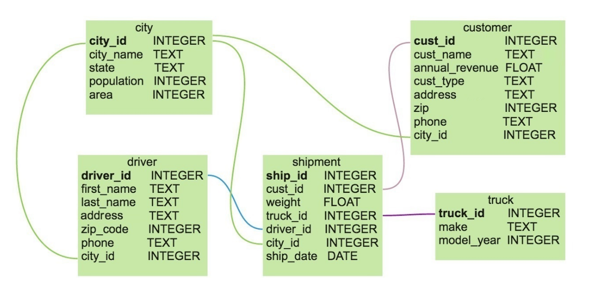

## Сложные объединения ##

### Схема датасета ###



----

### city ###

    city_id     INTEGER     уникальный идентификатор города, первичный ключ
    city_name   TEXT        название города
    state       TEXT        штат, к которому относится город
    population  INTEGER     население города
    area        NUMERIC     площадь города

----

### customer ###

    cust_id         INTEGER     уникальный идентификатор клиента, первичный ключ
    cust_name       TEXT        название клиента
    annual_revenue  NUMERIC     ежегодная выручка
    cust_type       TEXT        тип пользователя
    address         TEXT        адрес
    zip             INTEGER     почтовый индекс
    phone           TEXT        телефон
    city_id         INTEGER     идентификатор города, внешний ключ к таблице
                                city

----

### driver ###

    driver_id       INTEGER     уникальный идентификатор водителя, первичный ключ
    first_name      TEXT        имя водителя
    last_name       TEXT        фамилия водителя
    address         TEXT        адрес водителя
    zip_code        INTEGER     почтовый индекс водителя
    phone           TEXT        телефон водителя
    city_id         INTEGER     идентификатор города водителя, внешний ключ
                                к таблице city

----

### truck ###

    truck_id    INTEGER     Уникальный идентификатор грузовика, первичный ключ
    make        TEXT        Производитель грузовика
    model_year  INTEGER     Дата выпуска грузовика

----

### shipment ###

    ship_id     INTEGER     уникальный идентификатор доставки, первичный ключ
    cust_id     INTEGER     идентификатор клиента, которому отправлена доставка,
                            внешний ключ к таблице customer
    weight      NUMERIC     вес посылки
    truck_id    INTEGER     идентификатор грузовика, на котором отправлена
                            доставка, внешний ключ к таблице truck
    driver_id   INTEGER     идентификатор водителя, который осуществлял
                            доставку, внешний ключ к таблице driver
    city_id     INTEGER     идентификатор города в который совершена доставка,
                            внешний ключ к таблице city
    ship_date   DATE        дата доставки

----

#### **Задание 1** ####

Название города с максимальным весом единичной доставки.

```sql
SELECT c.city_name
FROM sql.shipment AS s
JOIN sql.city AS c ON s.city_id = c.city_id
ORDER BY s.weight DESC
LIMIT 1
```

Сколько различных производителей грузовиков перечислено в таблице **truck**?

```sql
SELECT COUNT(DISTINCT make)
FROM sql.truck
```

Как зовут водителя (`first_name`), который совершил наибольшее количество
доставок одному клиенту?

```sql
SELECT
    d.first_name,
    COUNT(*) AS cnt
FROM sql.shipment AS s
JOIN sql.driver AS d ON s.driver_id = d.driver_id
GROUP BY s.driver_id, s.cust_id, d.first_name
ORDER BY cnt DESC
LIMIT 1
```

Имя клиента, получившего наибольшее количество доставок за 2017 год.

```sql
SELECT
    c.cust_name,
    COUNT(*) AS cnt
FROM sql.shipment AS s
JOIN sql.customer AS c ON s.cust_id = c.cust_id
WHERE s.ship_date BETWEEN '2017-01-01' AND '2017-12-31'
GROUP BY c.cust_name
ORDER BY cnt DESC
LIMIT 1
```

----

#### **Задание 2** ####

Написать запрос, который создает уникальный алфавитный справочник всех городов,
штатов, имён водителей и производителей грузовиков. Результатом запроса должны
быть два столбца: название и тип объекта (`city`, `state`, `driver`, `truck`).

Отсортировать список по названию объекта, а затем&nbsp;&mdash; по типу.

```sql
SELECT
    city_name AS object_name,
    'city' AS object_type
FROM sql.city

UNION

SELECT
    state,
    'state'
FROM sql.city

UNION

SELECT
    first_name,
    'driver'
FROM sql.driver

UNION

SELECT
    make,
    'truck'
FROM sql.truck

ORDER BY object_name, object_type
```

----

#### **Задание 3** ####

Написать запрос, который соберёт имена всех упомянутых городов и штатов с
таблицы **city**. Результатом запроса должен быть один столбец `object_name`,
отсортированный в алфавитном порядке.

```sql
SELECT city_name AS object_name
FROM sql.city

UNION ALL

SELECT state
FROM sql.city

ORDER BY object_name
```

----

#### **Задание 4** ####

Выполнив предыдущий запрос, получены города с одинаковыми названиями, но
находящиеся в разных штатах, а также большое количество дублирующихся названий
штатов.    
Переписать предыдущий запрос так, чтобы остались только уникальные названия
городов и штатов. Результатом запроса должен быть один столбец `object_name`,
отсортированный в алфавитном порядке.

```sql
SELECT city_name AS object_name
FROM sql.city

UNION

SELECT state
FROM sql.city

ORDER BY object_name
```

----

#### **Задание 5** ####

Написать запрос, который объединит в себе все почтовые индексы водителей и их
телефоны в единый столбец-справочник `contact`. Также добавьте столбец с именем
водителя `first_name` и столбец `contact_type` с типом контакта (`phone` или
`zip` в зависимости от типа).    
Отсортировать список по столбцу с контактными данными в порядке возрастания, а
затем&nbsp;&mdash; по имени водителя.

```sql
SELECT
    zip_code::text AS contact,
    first_name,
    'zip' AS contact_type
FROM sql.driver

UNION ALL

SELECT
    phone::text,
    first_name,
    'phone'
FROM sql.driver

ORDER BY contact, first_name
```

----

#### **Задание 6** ####

Написать запрос, который выводит общее число доставок `total_shipments`, а также
количество доставок в каждый день. Необходимые столбцы: `date_period`,
`cnt_shipment`. Не забыть о единой типизации. Упорядочить по убыванию столбца
`date_period`.

```sql
SELECT
    s.ship_date::text AS date_period,
    COUNT(*) AS cnt_shipment
FROM sql.shipment AS s
GROUP BY s.ship_date

UNION ALL

SELECT
    'total_shipments',
    COUNT(*)
FROM sql.shipment

ORDER BY date_period DESC
```

----

#### **Задание 7** ####

Написать запрос, который выведет все города и штаты, в которых они расположены,
а также информацию о том, была ли осуществлена доставка в этот город:

- если в город была осуществлена доставка, то выводится 'доставка осуществлялась';
- если нет&nbsp;&mdash; выводится 'доставка не осуществлялась'.

Столбцы к выводу: `city_name`, `state`, `shipping_status`.    
Отсортировать в алфавитном порядке по городу, а затем&nbsp;&mdash; по штату.

```sql
SELECT
    c.city_name AS city_name,
    c.state AS state,
    'доставка осуществлялась' AS shipping_status
FROM sql.city AS c
LEFT JOIN sql.shipment AS s ON c.city_id = s.city_id
GROUP BY c.city_id
HAVING COUNT(s.ship_id) > 0

UNION ALL

SELECT
    cc.city_name,
    cc.state,
    'доставка не осуществлялась'
FROM sql.city AS cc
LEFT JOIN sql.shipment AS ss ON cc.city_id = ss.city_id
GROUP BY cc.city_id
HAVING COUNT(ss.ship_id) = 0

ORDER BY city_name, state
```

----

#### **Задание 8** ####

Написать запрос, который выводит два столбца: `city_name` и `shippings_fake`.
Вывести города, куда совершались доставки. Пусть первый столбец содержит
название города, а второй формируется так:

- если в городе было более десяти доставок, вывести количество доставок в этот
город как есть;
- иначе&nbsp;&mdash; вывести количество доставок, увеличенное на пять.

Отсортировать по убыванию получившегося &laquo;нечестного&raquo; количества
доставок, а затем&nbsp;&mdash; по имени в алфавитном порядке.

```sql
SELECT
    c.city_name AS city_name,
    COUNT(s.ship_id) AS shippings_fake
FROM sql.city AS c
JOIN sql.shipment AS s ON c.city_id = s.city_id
GROUP BY c.city_id
HAVING COUNT(s.ship_id) > 10

UNION ALL

SELECT
    cc.city_name,
    COUNT(ss.ship_id) + 5
FROM sql.city AS cc
JOIN sql.shipment AS ss ON cc.city_id = ss.city_id
GROUP BY cc.city_id
HAVING COUNT(ss.ship_id) <= 10

ORDER BY shippings_fake DESC, city_name
```

----

#### **Задание 9** ####

Написать запрос, который выберет наибольшее из значений:

```text
1000000;
541;
-500;
100.
```

Столбец с результатом назвать `result`.

```sql
SELECT MAX(num) AS result
FROM
(
    SELECT 1000000 as num
    UNION
    SELECT 541
    UNION
    SELECT -500
    UNION
    SELECT 100
) AS n
```

----
